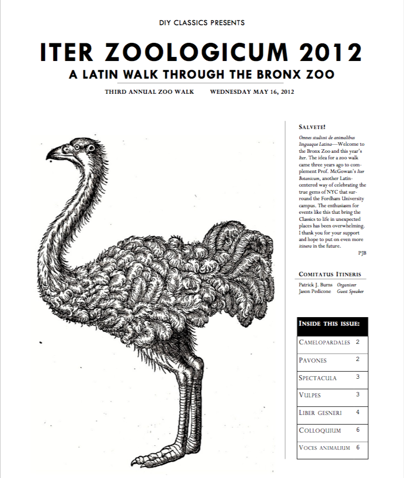

  

While a graduate student at Fordham University, I started leading annual Latin-themed field trips to the Bronx Zoo. I called the event, *Iter Zoologicum*, following the example of Prof. Matthew McGowan's *Iter Botanicum* walks at the nearby New York Botanical Gardens. The walks have roots in, what I have come to call, the peripatetic classicism of Latin teacher, Reginald Foster. Foster used to take his students around Rome and nearby locations to read works of Latin literature *in situ*, a model I have adapted for the *Itinera*. This style of teaching has now become a core part of programming from the Paideia Institute and I have collaborated with Paideia on developing field trips and similar site-specific learning events, such as the recent [*Iter Musaicum* scavenger hunt](https://www.paideiainstitute.org/events/iter-musaicum){:target="\_blank"} at New York's Metropolitan Museum of Art.

I have presented on this topic at the [CAAS 2014 Annual Meeting](../carpe-iter) and as part of the Paideia Institute panel at [CAAS 2017](../latin-in-unexpected-places). Based on this work, I am preparing an article on Latin-themed field trips for *Teaching Classical Languages* in which I discuss how the *Itinera* demonstrate five key qualities that that complement traditional, classroom-based language learning: authenticity, directness, allowance for free-choice, novelty, and fun.

Here is a list of resources (in progress!) that may be helpful to Latin teachers looking to leading field trips of their own. I will continue to update this page as I find more materials.

### Articles/Notes

- Burns, P.J. 2014. [*Suggestions for Organizing* Itinera Latina](https://www.dropbox.com/s/dph5xpo5az05vrs/suggestions-for-organizing-iz.pdf?dl=0){:target="\_blank"}

### Programs

- [*Iter Zoologicum* 2012 program](https://www.dropbox.com/s/yt8c0nzu9z0yrqz/IZ-2012-Program.pdf?dl=0){:target="\_blank"}
- [*Iter Zoologicum* 2014 program](https://www.dropbox.com/s/xqk6ecql9r77vmm/IZ-2014-Program.pdf?dl=0){:target="\_blank"}
- [*Iter Zoologicum* 2015 program](https://www.dropbox.com/s/67zm91htk0631yx/IZ-2015-Program.pdf?dl=0){:target="\_blank"}
- [*Iter Zoologicum* 2016 program](https://www.dropbox.com/s/5ixdlo9xvprkd8j/IZ-2016-Program.pdf?dl=0){:target="\_blank"}

If you have any question about these resources, email me at patrick[at]diyclassics[dot]org.
