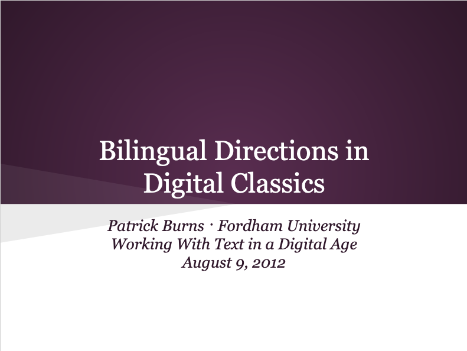

# Bilingual Directions in Digital Classics
Presentation at NEH Institute for Advanced Topics in the Digital Humanities on "Working with Text in the Digital Age" at Tufts University
August 9, 2012

{:.paper-section-heading}
## Description
As part of a ["Working with Text in the Digital Age"](https://sites.tufts.edu/perseusupdates/2013/10/28/publishing-text-for-a-digital-age/), a three-week NEH institute on digital methods for working with historical-language text hosted by Tuft's [Perseus Project](http://www.perseus.tufts.edu/hopper/), we were asked to present on a potential application for what we had learned. I came up with a "plan to develop an introductory textbook for simultaneously teaching Latin and Greek" that would take advantage of digitized texts of early Modern Greek-Latin bilingual editions, in particular [J. J. Scaliger's edition](https://books.google.com/books?id=3ouWVTwpytgC&pg=PP10#v=onepage&f=false) of the *Disticha Catonis*—still something that I would like to write someday.

Slides from this presentation are available at [http://bit.ly/burns-bilingual-directions](http://bit.ly/burns-bilingual-directions).

