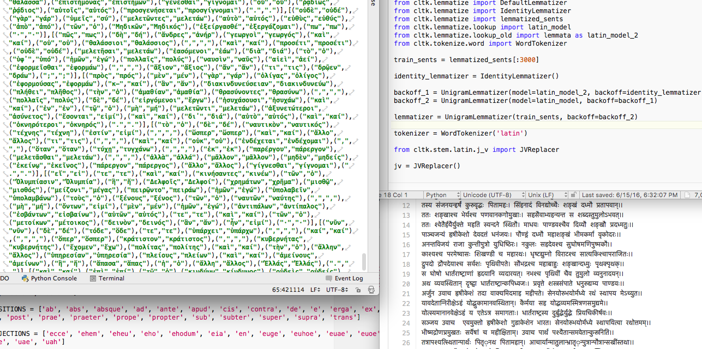

For Summer 2016, I worked on improvements to the Latin and Greek lemmatizer in the Classical Language Toolkit as part of Google Summer of Code. [Here](https://disiectamembra.wordpress.com/2016/08/23/wrapping-up-google-summer-of-code/) is a report I wrote summarizing the work.
