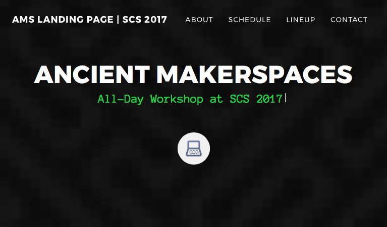

Jekyll-based landing page to promote Ancient MakerSpaces at the 2017 Annual Meeting of the Society of Classical Studies. The live version of the site is available at [https://diyclassics.github.io/ams/](https://diyclassics.github.io/ams/).