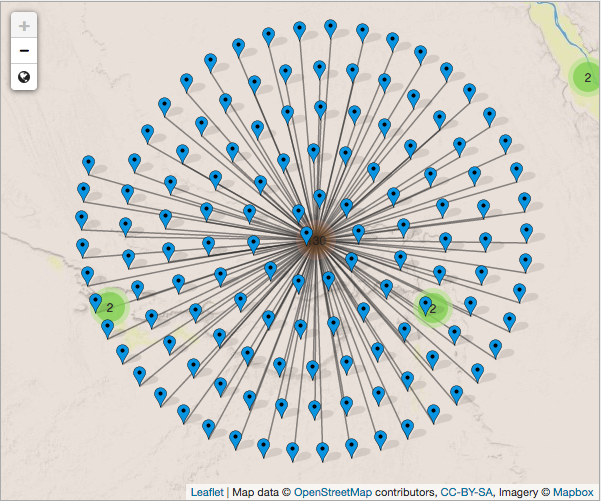

Map-based discovery system for ISAW Library's recent acquisitions. The site uses leaflet.js to display geocoded subjects, e.g. "Egypt (General)" = Lat. 26, Long. 30, and MarkerCluster to handle multiple entries for a given set of coordinates. The site is built in Jekyll and deployed through Github Pages. The live version of the site is available at [https://diyclassics.github.io/marc-pleiades/](https://diyclassics.github.io/marc-pleiades/).

{:.paper-section-heading}
## Select Bibliography

{:.bibliography}
- Bennett, R., E.T. O’Neill, K. Kammerer, and J. D. Shipengrover. (2011). mapFAST: A FAST Geographic Authorities Mashup with Google Maps, The Code4Lib Journal, 14. http://journal.code4lib.org/articles/5645 (accessed 28 March 2017).
- Cole, T.W., M. Han, W.F. Weathers, and E. Joyner. (2013). “Library MARC Records into Linked Open Data: Challenges and Opportunities.” Journal of Library Metadata, 13(2-3): 163–96. doi:10.1080/19386389.2013.826074.
- Freeland, C., M. Kalfatovic, J. Paige, and M. Crozier. (2008). Geocoding LCSH in the Biodiversity Heritage Library, The Code4Lib Journal, 2. http://journal.code4lib.org/articles/52 (accessed 28 March 2017).
- Gillies, S., J. Becker, E. Robinson, A. Rabinowitz, T. Elliott, S. Bond, B. Turner, S. Dunn, N. Kaye, and R. Horne. (2017) “Conceptual Overview.” Pleiades: A Gazetteer of Past Places. https://pleiades.stoa.org/help/conceptual-overview.
- MIT Libraries, Ad Hoc Task Force on the Future of Libraries. (2016). Institute-Wide Task Force on the Future of Libraries—Preliminary Report https://future-of-libraries.mit.edu/sites/default/files/FutureLibraries-PrelimReport-Final.pdf (accessed 28 March 2017).
- Papadakis, I., K. Kyprianos, and M. Stefanidakis. (2015). Linked Data URIs and Libraries: The Story So Far, D-Lib Magazine, 21(5/6). http://www.dlib.org/dlib/may15/papadakis/05papadakis.html (accessed 28 March 2017).
- Shieh, J., and T. Reese. (2015) “The Importance of Identifiers in the New Web Environment and Using the Uniform Resource Identifier (URI) in Subfield Zero ($0): A Small Step That Is Actually a Big Step.” Journal of Library Metadata, 15(3-4): 208–26. doi:10.1080/19386389.2015.1099981