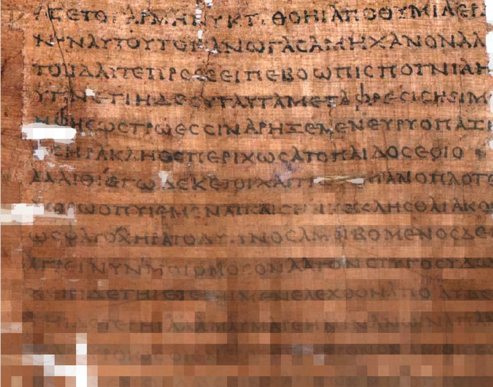

### Introduction to Digital Humanities for the Ancient World
*Fall 2017 Seminar at the Institute for the Study of the Ancient World*  
*Patrick J. Burns, Sebastian Heath, Tom Elliott, David Ratzan*  
*ISAW-GA 3024-001*  
*Mondays, 2:00pm-5:00pm*  

This course will introduce students to the use of digital tools and computational methods in the study of the Ancient World. There are no technical prerequisites and the course will be of particular interest to early stage graduate students who want a broad introduction that involves hands-on work. The course will progress through areas such as applying structure to text via XML-based markup languages, introduction to the programmatic manipulation of textual data, and how scholarly resources are shared on the public internet and edited in collaborative environments, including GitHub. There will also be a focus on structured datasets stored in relational databases. Students will gain practical experience in acquiring, creating, querying, and displaying spatial data. Visual approaches such as 3d modeling will also be explored. There will be frequent introductions to existing work in disciplines that are part of the study of the ancient world, including papyrology, numismatics, textual studies, history, and archaeology. Readings will introduce students to current trends in Digital Humanities and will encourage discussion of the impact digital methods and open-licensed content are having on research, teaching, and public engagement with scholarly practice. Over the course of the semester students will design and then implement a final project that can overlap with existing research interests. Students are required to bring their own notebook computers to class. Permission of the instructors is required.  

Contact [Patrick J. Burns](mailto:patrick.j.burns@nyu.edu) for more information. More information about course offering at ISAW is available at [http://isaw.nyu.edu/graduate-studies/seminar-descriptions](http://isaw.nyu.edu/graduate-studies/seminar-descriptions).

Photo credit: Public domain image of P. Oxy. 551 via [Wikimedia Commons](http://bit.ly/POx551-wmcommons)
