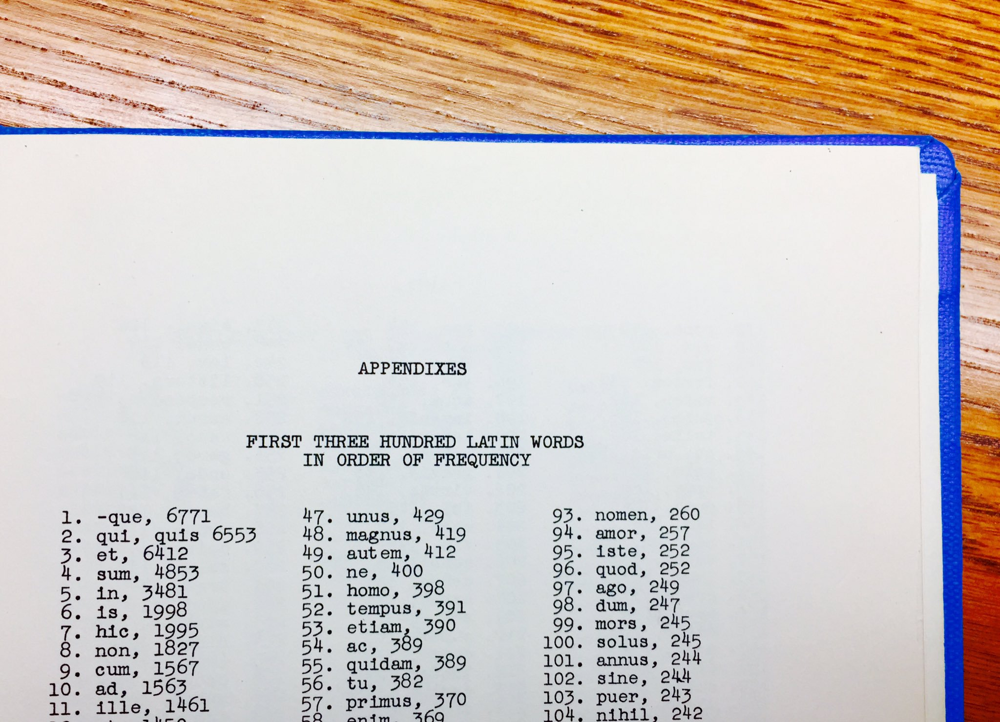

<!---  --->

## Digital Approaches to Latin Vocabulary
*Panel at the 2017 Annual Meeting of the Classical Association of the Atlantic States*  
*Friday, October 6 2017. New York, NY.*

The importance of vocabulary acquisition in training competent readers of Classical literature has long been recognized (Muccigrosso 2004; Major 2008). But this field has taken a digital turn. Electronic lexical resources such as the Perseus Word Study Tool and app-based dictionaries like Logeion have brought reference materials onto our students' devices. Online lists of high-frequency vocabulary help students make efficient progress through readings (Francese 2014). Digital approaches to vocabulary learning “adapt their formats to the particular background and immediate needs of particular readers” (Crane 2007). Digital advances in working with Latin vocabulary have been accelerated by the availability of open-access text collections and these resources are now staples of Classical language pedagogy. As recently as 2011, a reviewer of Greek textbooks lamented that “we are tentatively leveraging these new technologies mostly to do what we’ve been doing all along, only with greater agility” (Trzaskoma 2011). But increasingly Classical language teachers are pushing pedagogical boundaries and incorporating digital methods in ways which are not simply more agile but rather transformative. This panel presents recent work in vocabulary assistance for emerging Latin readers.

This panel should appeal to instructors interested in vocabulary analysis and the application of computational techniques to their work. The presentations are rooted in classroom reading practices and should appeal to audiences of both K-12 and university instructors. We include an introductory talk to offer context in a rapidly changing field and a closing response to provide perspective on the adoption of digital methods for vocabulary learning.

Contact [Patrick J. Burns](mailto:patrick.j.burns@nyu.edu) for more information. Complete CAAS 2017 program available [here](http://caas-cw.org/wp/wp-content/uploads/2017/07/august-22-draftCAAS2017program.doc).

#### Panel Details

***Introduction*** John Muccigrosso

***Facilitating contextualized vocabulary acquisition*** Ivy Livingston  
This talk reports on the development of an online tool to help Latin teachers choose texts that align with particular vocabulary. It works by comparing the words of any text to a user-customizable database. The goal is to increase extensive reading by making it easier to: 1. determine whether a text contains high percentages of known vocabulary, and 2. prioritize unknown words for pre-teaching. Conversely, the tool can be used to find texts containing particular target vocabulary, such as high-frequency words, in order to facilitate contextual learning.

***Creating useful vocabulary lists using The Bridge*** Bret Mulligan  
This talk introduces The Bridge, a web-based application that enables users to generate customized vocabulary lists from a database of Classical texts. Users can create lists of “new” words by filtering out vocabulary in specific textbooks, core lists, or texts they have already read. Using The Bridge allows students and instructors to identify common vocabulary in course readings or to gloss uncommon vocabulary to facilitate reading. The Bridge currently supports most major Latin textbooks, as well as many commonly read texts, including Vergil and Caesar. The talk demonstrates features such as creating a list of supplemental vocabulary for sight exams and building an integrated approach to vocabulary acquisition for an entire course.

***Curated vocabulary lists and digital flashcards in the Latin classroom*** William Turpin  
This talk looks at the coordinated use of curated vocabulary lists and digital flashcards in recent Latin reading courses. With a platform like The Bridge, it is now relatively simple to provide students with vocabulary directly relevant to particular assignments. These lists can also be imported into Brainscape, a digital flashcard app that gives students access to the material on any internet-connected device. Students can work with vocabulary in a form that encourages them to study efficiently and at their convenience. After two years of using this approach, I believe these technologies have much to offer. Students seem to find preparation for classes more rewarding and their vocabulary knowledge strengthened.

***Using topic modeling to generate sight-reading passages for Classical language learning*** Thomas Köntges  
Topic modeling helps to cluster large corpora using statistical inference. I wrote a personalized teaching app using topic modeling for a reading course on Thucydides. My team recorded which passages the students already encountered, and using this knowledge and the topic distribution of Thucydides' work, passages appropriate for the students’ skill level were automatically retrieved and unknown vocabulary was linked to an online dictionary. The method has since been adapted to Caesar’s Gallic War. Recent work with ancient language treebanks has also made it possible to retrieve individual grammatical phenomena in these works.

***Response*** Patrick J. Burns

{:.paper-section-heading}
## Select Bibliography

{:.bibliography}
- Carlon, J. 2016. “Quomodo Dicitur? The Importance Of Memory In Language Learning,” Teaching Classical Languages 7(2): 109-135.
- Clark, R. 2009. “The 80% Rule: Greek Vocabulary in Popular Textbooks,” Teaching Classical Languages 1(1): 67-108.
- Crane, G., D. Bamman, and A. Babeu. 2007. “Philology in an Electronic Age.” http://dl.tufts.edu/catalog/tufts:PB.001.001.00010.
- Francese, C. 2014. “Latin Core Vocabulary.” Dickinson College Commentaries. http://dcc.dickinson.edu/latin-vocabulary-list, accessed March 1, 2017.
- Muccigrosso, J.D. 2004. “Frequent Vocabulary in Latin Instruction.” CW 97(4): 409–33; doi:10.2307/4352875.
- Major, W.E. 2008. “It’s Not the Size, It’s the Frequency: The Value of Using a Core Vocabulary in Beginning and Intermediate Greek.” CPL Online 4(1): 1-24.
- Rydberg-Cox, J. A, and A. Mahoney. 2002. “Vocabulary Building in the Perseus Digital Library.” CO 79(4): 145–149.
- Trzaskoma, S. 2011. “Innovation in Recent Intermediate Greek Textbooks?” Teaching Classical Languages 3(1): 63-70.
- Vanderpool, E. 2016. “A Digital Bridge to Authentic Latin: Eutropius for a New Generation.” Thesis, Monmouth College.
