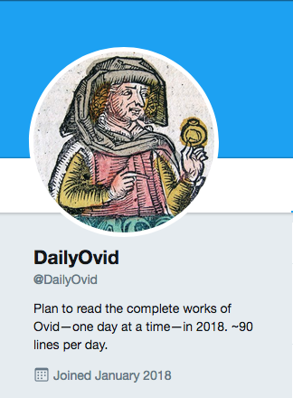

Twitterbot that tweets a citation—a CTS URN, no less—to a passage from Ovid's corpus once per day. The passages are organized so that you could read the complete works of Ovid in 365 days, a pace of roughly 90 lines per day.
