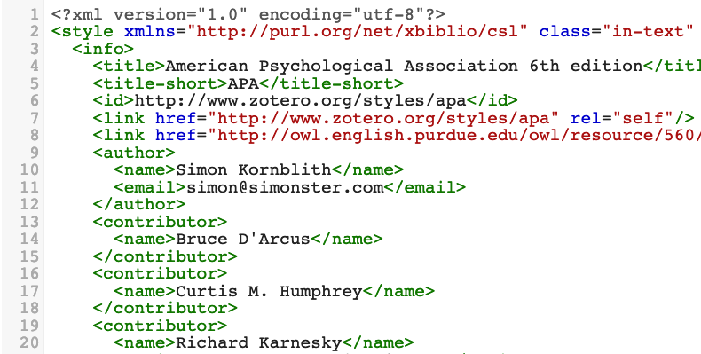

# Working with Citation Style Language and Zotero
Notes for workshop led at ISAW Library on 2.28.19.
February 28, 2019

  

{:.paper-section-heading}
## Description
This workshop will introduce participants to working with .csl (citation style language) files for the purposes of customizing their bibliographies. The emphasis will be on Zotero integration, but will be applicable to any bibliographic management software that makes use of .csl sheets.

{:.paper-section-heading}
## Resources
- [Citation Style Language](https://citationstyles.org/)
  - [CSL Primer](http://docs.citationstyles.org/en/1.0.1/primer.html)
  - Authors [page](https://citationstyles.org/authors/)
  - Contributors [page](https://github.com/citation-style-language/styles/blob/master/CONTRIBUTING.md)
- Citation Style Language on [GitHub](https://github.com/citation-style-language)
  - Styles [repo](https://github.com/citation-style-language/styles)
- [CSL Editor](http://editor.citationstyles.org/about/)
  - [Visual Editor](http://editor.citationstyles.org/visualEditor/)
  - [Code Editor](http://editor.citationstyles.org/codeEditor/)
- [Zotero](https://www.zotero.org)
  - Zotero [CSL Editing Guide](https://www.zotero.org/support/dev/citation_styles/style_editing_step-by-step)

{:.paper-section-heading}
## Articles/posts/etc.
- *NatureJobs* blog post on the [CSL Editor](http://blogs.nature.com/naturejobs/2017/05/03/techblog-create-the-perfect-bibliography-with-the-csl-editor/)
- *Ideophone* blog post on ["Simple citation style edits: the power of CSL"](http://ideophone.org/zotero-citation-style-edit/)
