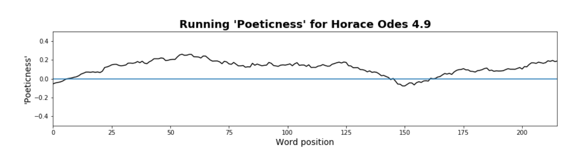

# 'Poeticness' as a Continuous Variable: Rethinking Prosaism in Horace's Odes 4.9
Abstract for Society of Classical Studies Annual Meeting 2020
*[Link to SCS2020 Program](https://classicalstudies.org/annual-meeting/2020/151/preliminary-program-2020-annual-meeting)*

{:.paper-section-heading}
## Abstract
In his study of Latin poetic diction Unpoetische Wörter, Bertil Axelson presents a compelling argument that Horace uses a particularly prosaic vocabulary in the Odes (Axelson 1945: 108–11; cf. Wilkinson 1959; McDermott 1982). So convinced is Axelson of the prosaicness of the closing lines of Odes 4.9 that he prints these verses “without line breaks to mark its stylistic character, which may be safely called ordinary prose (ordinären Prosa).” Since publication, Unpoetische Wörter has produced a productive debate, often critical of Axelson's work, on the use of Latin poetic diction (e.g. Ernout 1947; Williams 1968; Watson 1985; Lyne 1989). Ernout (1947, 68) expresses the critique well, namely that Axelson’s “simple listing [of word frequencies], purely statistical and comparative in nature, without an examination of usage in context" is insufficient for judging poetic style.

In this paper, following recent work in computational literary study (Underwood 2019; Piper 2017; Piper 2018; So 2017; also, McCarty 2004),  I revisit Axelson’s argument about prosaism in Odes 4.9 precisely with an “examination of usage in context” by recasting the study in new methodological terms, namely by leveraging digital text analysis to construct a literary model of “poeticness” in Latin literature. The method for this paper is as follows: 1. a tagged corpus of Latin verse and prose is used to model the probability of words occurring in either category; 2. each word in a given work is assigned a poeticness weight; and 3. these weights are plotted in narrative space, that is they are plotted such that the weight is given along the y-axis and the position of the word on the x-axis (i.e., first word at x=1, second at x=2, etc.). An example of the resulting visualization for Odes 4.9 can be seen in Fig. 1. Using a literary model to define poeticness allows us to “describe continua instead of sorting everything into discrete categories” (Underwood 2019: 20). What if rather than label a word like uxor as unpoetic, we instead label it as 10% poetic and 90% unpoetic? Modeling literary vocabulary as falling along a spectrum of poeticness leads to both a more nuanced measurement of individual words—one greatly assisted by computational power and storage—and a measurement that can be extended more productively to surrounding context.

***Fig. 1.*** *A “poeticness” score mapped across narrative time in Odes 4.9; the scores have been smoothed within a window of 25 words, that is a running mean has been computed for the 12 words preceding, the word itself,  and the 12 words following. The same settings (e.g. window size, etc.) have been used for the plots that follow.*

I begin with a reading of Odes 4.9 that concludes that Axelson’s readerly instinct is correct and that the diction in the second half of this poem is, according to the model, comparatively unpoetic. In the remainder of the paper, I move towards increasingly distant readings of Horace, from the other poems in Odes 4 to the Odes overall to his entire multigeneric corpus, as an exploratory analysis of quantifiable moments of unpoeticness in his works.

In the wake of recent debate on computational literary studies (e.g. Da 2019 and responses in the corresponding Critical Inquiry forum), this paper demonstrates how a computational approach to a Latin literary critical problem can help, as one critic writes (Algee-Hewitt 2019), “[present] new kinds of evidence, often invisible to even the closest reader, alongside carefully considered theoretical arguments, both working in tandem to produce new critical work.” Accordingly, I revisit by way of conclusion Gian Biagio Conte’s distinction between “exemplary” models and code “models” (Conte 1986). Much large-scale digital literary critical work on Latin poetry (e.g. Coffee et al. 2012) has focused on diction matching and the search for explicit allusive activity, what Conte sees as the exemplary model. This paper uses a systematic valuation of poeticness to gesture toward the “poetic memory” aspect of Conte’s work, that is the code model, or a "series of phenomena that could be otherwise registered only piecemeal, in uncoordinated, discrete details," expanding the range of Latin literary critical problems that can be addressed through computational analysis.

{:.paper-section-heading}
## Works Cited

- Adams, J.N., and Mayer, R. 1999. “Introduction.” In Adams, J.N. and Mayer, R. eds. ​Aspects of the Language of Latin Poetry.​ Proceedings of the British Academy 93. Oxford: Oxford University Press. 1–18.
- Algee-Hewitt, M. 2019. “Criticism, Augmented.” Participant Forum Responses on Computational Literary Studies. ​Critical Inquiry: In the Moment​. https://critinq.wordpress.com/2019/04/01/computational-literary-studies-participant-forum-responses/.
- Algee-Hewitt, M., Allison, S., Gemma, M., Heuser, R., Moretti, F., and Walser, H. 2016. “Canon/Archive. Large-Scale Dynamics in the Literary Field.” ​Pamphlets of the Stanford Literary Lab​ 11: 1–13.
- Axelson, B. 1945. ​Unpoetische Wörter: Ein Beitrag Zur Kenntnis Der Lateinischen Dichtersprache.​ Lund: H. Ohlsson.
- Bengfort, B., Bilbro, R., and Ojeda, T. 2018. ​Applied Text Analysis with Python: Enabling Language-Aware Data Products with Machine Learning​. Sebastopol, CA: O’Reilly.
- Burns, P.J. 2017. “Measuring and Mapping Intergeneric Allusion in Latin Poetry Using Tesserae.” ​Journal of Data Mining & Digital Humanities:​ 16.
- Chaudhuri, P., Dasgupta, T., Dexter, J.P., and Iyer, K. 2018. “A Small Set of Stylometric Features Differentiates Latin Prose and Verse.” ​Digital Scholarship in the Humanities​ 34 (4): 716–29. doi:10.1093/llc/fqy070.
- Commager, S. 1995. ​The Odes of Horace: A Critical Study.​ Norman, OK: University of Oklahoma Press.
- Conte, G.B. 1986. ​The Rhetoric of Imitation: Genre and Poetic Memory in Virgil and Other Latin Poets​. Translated by Charles Segal. Ithaca, NY: Cornell University Press.
- Da, N.Z. 2019. “The Computational Case against Computational Literary Studies.” ​Critical Inquiry​ 45 (3): 601–39. doi:10.1086/702594.
- Ernout, A. 1947. “[Review of ‘Unpoetische Wörter’ by B. Axelson].” ​RPLHA​ 21: 55–70. Fraenkel, E. 1957. ​Horace.​ Oxford: Clarendon Press.
- Harrison, S.J., ed. 2017. ​Horace: Odes Book II​. Cambridge: Cambridge University Press.
- Knox, P.E. 2013. “Language, Style, and Meter in Horace.” In ​Brill’s Companion to Horace.​ Leiden: Brill. 527–46. https://brill.com/view/book/edcoll/9789004241961/B9789004241961-s011.xml.
- Lee, M.O. 1969. ​Word, Sound, and Image in the Odes of Horace.​ Ann Arbor, MI: University of Michigan Press.
- Lowrie, M. 1997. ​Horace’s Narrative Odes​. Oxford: Clarendon Press.
- Lyne, R.O.A.M. 1989. ​Words and the Poet: Characteristic Techniques of Style in Vergil’s Aeneid.​ Oxford: Clarendon Press.
- Mayer, R., ed. 2012. ​Horace: Odes Book I.​ Cambridge: Cambridge University Press.
- McCarty, W. 2004. “Modeling: A Study in Words and Meanings.” In Schreibman, S., Siemens, R., and Unsworth, J. eds. ​A Companion to Digital Humanities​. Malden, MA: Blackwell Publishing Ltd. 254–70. doi:10.1002/9780470999875.ch19. http://doi.wiley.com/10.1002/9780470999875.ch19.
- McDermott, E. 1982. “Horace, Maecenas and Odes 2.17.” ​Hermes​ 110 (2): 211–28. Muecke, F. 1997. “Lingua e Stile.” In Mariotti, S. ed. ​Enciclopedia Oraziana​. 2:755–785.
- Piper, A. 2017. “Think Small: On Literary Modeling.” ​PMLA​ 132 (3): 651–58. doi:10.1632/pmla.2017.132.3.651.
- ———. 2018. ​Enumerations: Data and Literary Study.​ Chicago: University of Chicago Press. Rockwell, G., and Sinclair, S. 2016. ​Hermeneutica: Computer-Assisted Interpretation in the Humanities​. Cambridge, MA.
- So, R.J. 2017. “All Models Are Wrong.” ​PMLA​ 132 (3): 668–73. doi:https://doi.org/10.1632/pmla.2017.132.3.668.
- Thomas, R.F., ed. 2011. ​Horace: Odes Book IV and Carmen Saeculare.​ Cambridge: Cambridge University Press.
- Underwood, T. 2019. ​Distant Horizons: Digital Evidence and Literary Change.​ Chicago: University of Chicago Press.
- Watson, P. 1985. “Axelson Revisited: The Selection of Vocabulary in Latin Poetry.” ​CQ​ 35 (2): 430–48. doi:10.1017/S0009838800040271.
- Wilkinson, L.P. 1959. “The Language of Virgil and Horace.” ​CQ​ 9 (3–4): 181–92. doi:10.1017/S0009838800041483.
- Williams, G.W. 1968. ​Tradition and Originality in Roman Poetry.​ Oxford: Clarendon Press.
