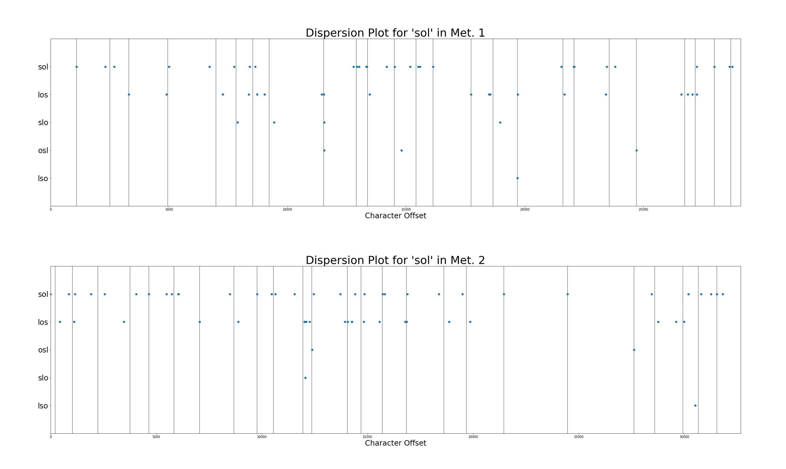

# Metaformalism, or Setting a Baseline for Detecting Anagrammatic Play in Ovid’s *Metamorphoses*
Abstract for Society of Classical Studies Annual Meeting 2021
*[Link to SCS2021 Abstract](https://classicalstudies.org/annual-meeting/152/abstract/metaformalism-or-setting-baseline-detecting-anagrammatic-play-ovid%E2%80%99s)*

{:.paper-section-heading}
## Abstract

Frederick Ahl’s Metaformations argues for pervasive wordplay based on the “anagrammatic rearrangements” of words and subwords (specifically syllables) in Ovid’s Metamorphoses among other works of Latin poetry. Some contemporary reviewers saw the book as “an extremely important, new critical tool” (Gross 1987). Yet others questioned the basis for such ludic literary criticism, with one reviewer writing: “Even as a modern structuralist system his method requires more rules about which syllables count and greater general rigour” (Harrison 1986).  In this paper, I set Ahl’s readings of syllabic wordplay against a systematic study of the frequency and distribution of trigrams (that is, three-letter subword combinations) within Ovid's poem in order to set a baseline for determining “which syllables count.” As a first step, each book of the Metamorphoses is transformed into its constituent trigrams (e.g. Met. 1.1 In noua fert... ~ ['inn', 'nno', 'nou', 'oua', 'uaf', 'afe', 'fer', 'ert', …]) and anagrammatic permutations of these trigrams are plotted and clustered (here, using k-means clustering). We can then compare the text sections with the smallest differences between clusters against the sections of text where Ahl has identified examples of concentrated wordplay. (See Figure 1 [https://bit.ly/scs-2021-metaformalism-abstract-img-1], for example, where tighter clustering of ‘sol’ anagrams occurs at the beginning of Book 2 as compared to Book 1; cf. Ahl 1985: 180-181 on “solar wordplays.”)

***Fig. 1.*** *A dispersion plot of 'SOL' trigrams shows tighter clustering at the beginning of Book 2 as compared to Book 1.*

As a second step, since Ahl describes anagrammatic wordplay as a localized effect, dispersion measures (such as Juilland’s D) are used to confirm an uneven distribution of anagrammatic trigrams in different books of the poem. So, for example, the ‘sol’ trigram shows a lower, i.e. less even, dispersion measure in Book 2 than in Book 1 (.751 vs. .837, where 1 indicates a completely even distribution; for comparison, note that ‘que’ shows .931), suggesting that is concentrated in specific passages of this book. The advantage of measuring, modeling, and mapping anagrammatic effects in these ways is not unlike that argued for in recent computational analyses of intertextuality in Latin poetry: that is, these methods help explicate and contextualize what readers have previously experienced as a “network of latent patterns” (Forstall and Scheirer 2019). The contribution of this study to Latin literary criticism is twofold: 1. it provides a baseline measurement of anagrammatic play in a major work of Latin literature against which qualitative arguments can be better situated; and 2. it repurposes a corpus-linguistic measure to make a quantitative argument not based solely on the frequency of features in texts but also on dispersion within them.

{:.paper-section-heading}
## Works Cited

- Ahl, F. 1985. Metaformations: Soundplay and Wordplay in Ovid and Other Classical Poets. Ithaca, NY: Cornell University Press.
- Claassen, J.-M. 1998. “Ovid’s Exilic Vocabulary.” Akroterion 43.
- ———. 1999. “The Vocabulary of Exile in Ovid’s Tristia and Epistolae Ex Ponto.” Glotta 75 (3./4. H): 134–171.
- Forstall, C.W., and Scheirer, W.J. 2019. Quantitative Intertextuality: Analyzing the Markers of Information Reuse. New York: Springer. doi:10.1007/978-3-030-23415-7. https://www.springer.com/gp/book/9783030234133.
- Gries, St Th. 2008. “Dispersions and Adjusted Frequencies in Corpora.” International Journal of Corpus Linguistics 13 (4): 403–437. doi:10.1075/ijcl.13.4.02gri.
- Gries, Stefan Th. 2020. “Analyzing Dispersion.” In Paquot, M. and Gries, S.Th. eds. A Practical Handbook of Corpus Linguistics. New York: Springer. doi:10.1007/978-3-030-46216-1. https://www.springer.com/gp/book/9783030462154.
- Gross, N. 1987. “Review: Metaformations: Soundplay and Wordplay in Ovid and Other Classical Poets, by F. Ahl.” The Classical World 80 (3): 219–20. JSTOR. doi:10.2307/4350023.
- Harrison, S.J. 1986. “Ovid Decoded? [Review: Metaformations: Soundplay and Wordplay in Ovid and Other Classical Poets, by F. Ahl].” The Classical Review 36 (2): 236–37. JSTOR.
- Lyne, A.A. 1986. “In Praise of Juilland’s D: A Contribution to the Empirical Evaluation of Various Measures of Dispersion Applied to Word Frequencies.” In Proceedings of the Colloque International CNRS, Université de Nice, 5-8 June 1985, Méthodes Quantitatives et Informatiques Dans l’étude Des Textes En Hommage à Charles Muller. 589–597.
- Mahlberg, M. 2013. “Corpus Analysis of Literary Texts.” The Encyclopedia of Applied Linguistics.
- Piper, A. 2018. Enumerations: Data and Literary Study. Chicago: University of Chicago Press.
- Underwood, T. 2019. Distant Horizons: Digital Evidence and Literary Change. Chicago: University of Chicago Press.
